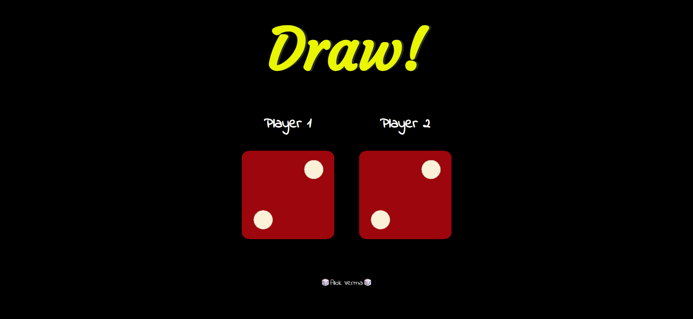

# Dice-Game

 - This is a simple web-based dice game that can be played by two players. 
 - The game generates two random numbers between 1 and 6, representing the numbers on the faces of two dice. 
 - The player with the higher number wins the game. If the numbers are the same, it is a draw.

 ## Snap
 
 ## Demo
 Try this [Game](https://alokverma18.github.io/Dice-Game/)

## Contributing
Feel free to Contribute by creating a Pull Request or an Issue.

## Connect 

## 
### Leave a 🌟 if it was Helpful!!
### Thanks!
